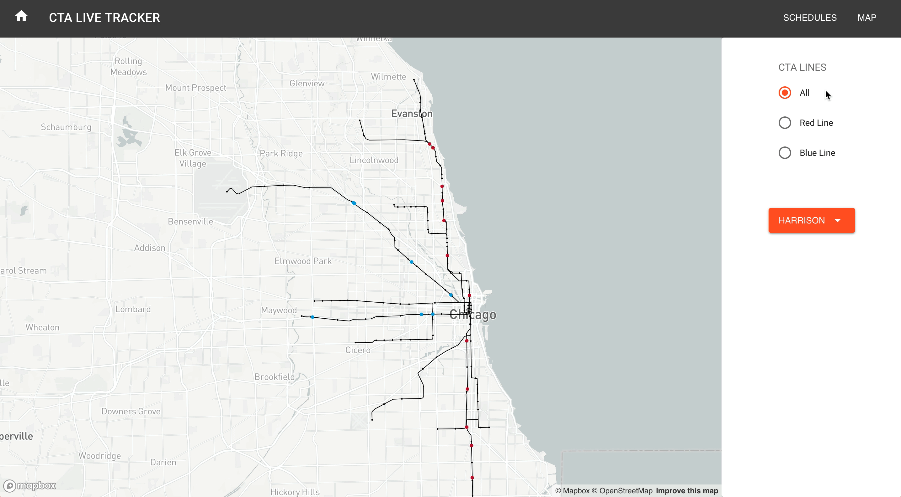

# CTA LIVE TRACKER
The objective of this project was to build a single page application to display live transit data from Chicago's CTA API.



## Getting Started
Clone or fork this repository

Get access tokens for Mapbox and Streamdata.io and replace the corresponding variables in client/components/MapView and server/stream/index with your own tokens

```
npm install
npm run dev-start
```

## Built With
Node, Express, Postgres, React, Redux, Mapbox, Streamdata.io

## Authors
Julianne Crawford
